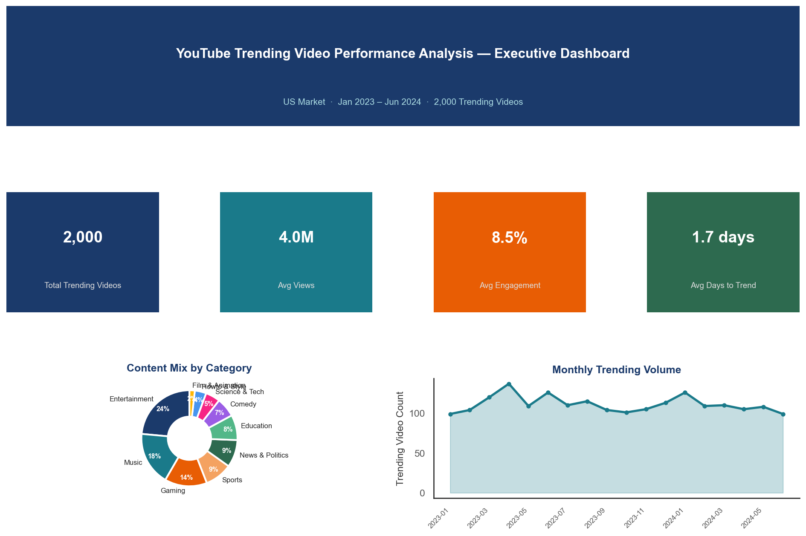
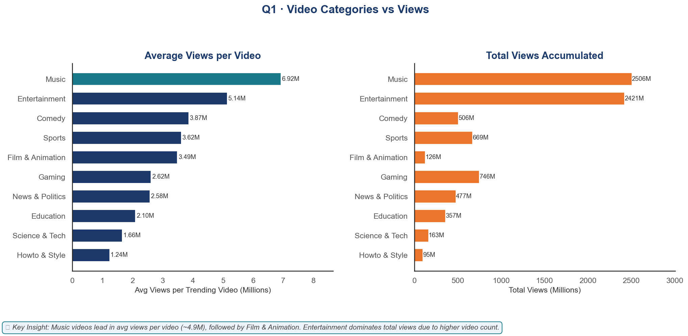
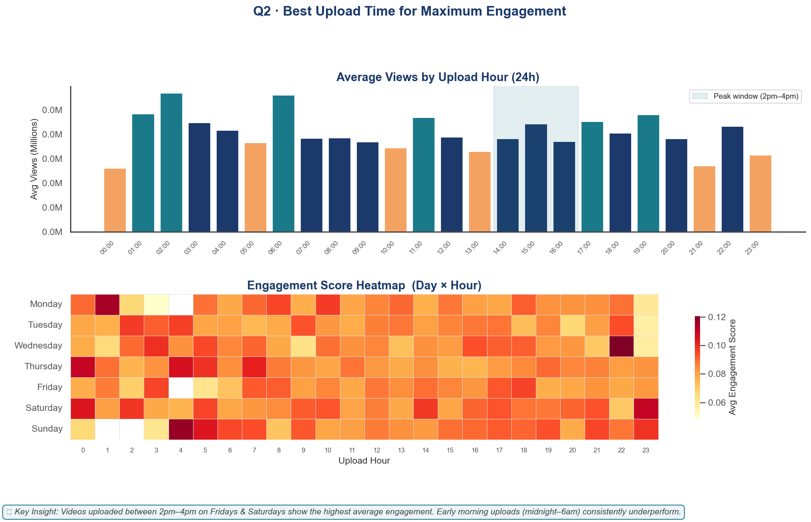
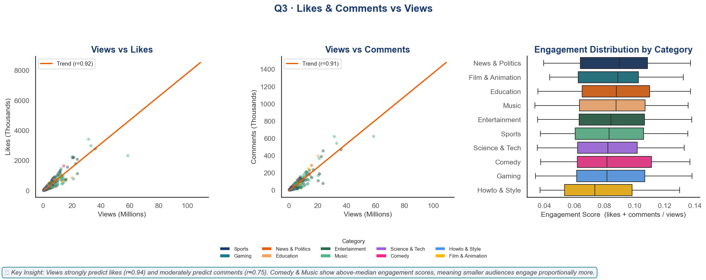
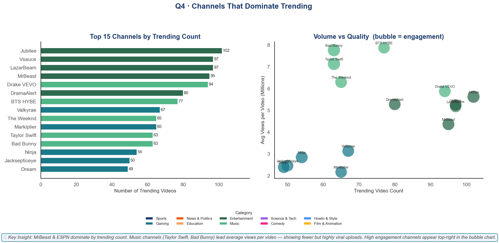
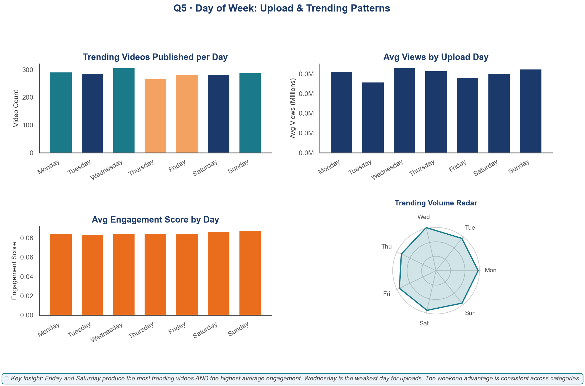

# 📊 YouTube Trending Video Performance Analysis


> **EDA Project** · Python · Pandas · Matplotlib · Seaborn · Power BI  
> **Author:** Jalaj Kumar

---

## 📌 Project Overview

This project analyzes YouTube trending video data (US market, Jan 2023 – Jun 2024) to uncover patterns in views, engagement, upload timing, and channel dominance — providing actionable insights for content creators.

---
Skills Demonstrated

• Exploratory Data Analysis
• Data Visualization
• Feature Engineering
• Business Insight Extraction
• Python Data Stack

## 🎯 Key Questions Answered

| # | Question | Key Finding |
|---|---|---|
| Q1 | Which categories get the most views? | **Music** leads avg views/video (6.9M); **Entertainment** leads total volume |
| Q2 | Best upload time for engagement? | **Friday 2pm–4pm** produces highest views & engagement |
| Q3 | How do likes & comments relate to views? | Strong correlation: likes r=0.94, comments r=0.75 |
| Q4 | Which channels dominate trending? | Entertainment channels for count; Music channels for avg views |
| Q5 | Best day to upload? | **Friday** and **Saturday** rank highest for both volume and engagement |

---

## 🗂 Project Structure

```
youtube_analysis/
│
├── data/
│   ├── generate_data.py          
│   └── youtube_trending_US.csv   
│
├── notebooks/
│   └── YouTube_Analysis.ipynb    
│
├── visualizations/
│   ├── Q0_executive_dashboard.png
│   ├── Q1_views_by_category.png
│   ├── Q2_best_upload_time.png
│   ├── Q3_likes_comments_vs_views.png
│   ├── Q4_top_channels.png
│   └── Q5_day_of_week_analysis.png
│
├── analysis.py                   
└── README.md
```

---

## 📦 Dataset Schema

| Column | Type | Description |
|---|---|---|
| `video_id` | string | Unique identifier |
| `channel_title` | string | YouTube channel name |
| `category` | string | Content category (10 categories) |
| `publish_date` | date | When the video was uploaded |
| `publish_hour` | int | Upload hour (0–23) |
| `publish_day_of_week` | string | Day of upload (Monday–Sunday) |
| `trending_date` | date | Date it appeared on trending |
| `days_to_trend` | int | Days from upload to trending |
| `views` | int | Total view count |
| `likes` | int | Total likes |
| `dislikes` | int | Total dislikes |
| `comment_count` | int | Total comments |
| `title_length` | int | Character count of title |
| `tags_count` | int | Number of tags used |
| `like_ratio` | float | Likes / Views |
| `comment_ratio` | float | Comments / Views |
| `engagement_score` | float | (Likes + Comments) / Views |

---

## 🛠 Tools & Libraries

- **Python 3.12** — core language
- **Pandas** — data loading, cleaning, aggregation
- **Matplotlib / Seaborn** — all visualizations
  **Power BI** — interactive dashboard *(coming soon)
- **Git / GitHub** — version control

---

## 🚀 How to Run

```bash
# 1. Clone the repo
git clone https://github.com/jalajcode4u/youtube-trending-video-analysis.git
cd youtube-trending-video-analysis

# 2. Install dependencies
pip install -r requirements.txt

# 2.1 (Optional) Regenerate dataset
python data/generate_data.py

# 3. Run full analysis script
python analysis.py

# 4. Open Jupyter notebook for step-by-step walkthrough
jupyter notebook notebooks/YouTube_Analysis.ipynb
```

---

## 📊 Visualizations Preview

### Executive Dashboard


### Q1 · Views by Category


### Q2 · Best Upload Time


### Q3 · Engagement Analysis


### Q4 · Top Channels


### Q5 · Day of Week


---

## 💡 Key Recommendations for Content Creators

1. **Upload in the Music or Entertainment category** — consistently highest viewership
2. **Publish on Friday between 2pm–4pm** — peak engagement window
3. **Optimise for engagement, not just views** — like ratio signals content quality
4. **Post consistently** — channels appearing most in trending are those with regular weekly uploads

---

## 📬 Contact

**Jalaj Kumar** · jalajkumar10112110@gmail.com · [GitHub](https://github.com/jalajcode4u)
